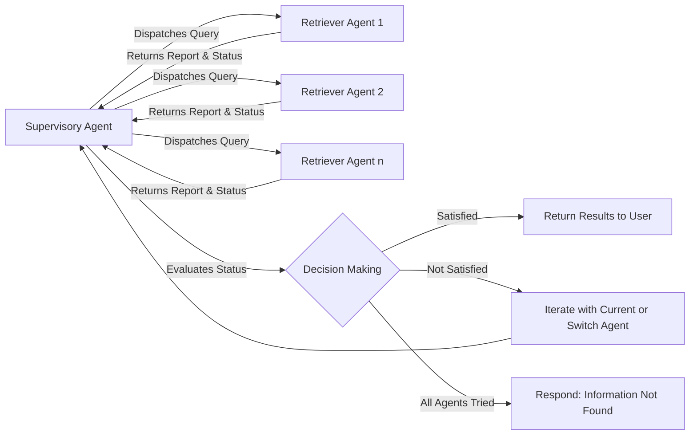

# Adaptive Swarm Retrieval: A Hierarchical Agent-Based Approach for Blind and Stateful Information Retrieval


The implementation of: ``**Adaptive Swarm Retrieval: A Hierarchical Agent-Based Approach for Blind and Stateful Information Retrieval''**. https://medium.com/@arash.mansoori65/adaptive-swarm-retrieval-a-hierarchical-agent-based-approach-for-blind-and-stateful-information-3e46188fcf25

## Description

Explore our groundbreaking approach to adaptive information retrieval in a dynamic, hierarchical swarm of specialized agents. Our GitHub repository presents a novel Retrieval Agent Graph (RAG) model, showcasing a supervisor agent that intelligently navigates through a network of retriever agents, each skilled in extracting specific types of data from various document parts, such as tables or textual content. This stateful, graph-based system excels in blind and adaptive information retrieval, dynamically selecting the optimal retriever for each user query without prior knowledge of which agent will yield the best results.

The core of our RAG system is a supervisory agent that acts as the initial query entry, delegating tasks to a suite of retriever agents. These retrievers attempt to gather pertinent information, reporting back their findings along with their success status. Should a retriever fall short, the supervisory agent seamlessly switches to another, iterating through the available agents in a structured process that ensures exhaustive exploration. This persistence guarantees that if information relatable to the query exists within the accessible data, our system will find it. If all options are exhausted without success, the system gracefully concedes with an informative response.

The accompanying diagram in our repository vividly illustrates this complex interaction:



Dive into our repository for a deep dive into this advanced, flexible, and capable RAG system that redefines the boundaries of adaptive and intelligent information retrieval.

## Installation

Install all the necessary requirements.

```sh
pip install -r requirements.txt
```

## Environment Variables

Create a .env file and set your ```openai``` API key.

## Data

### Download

In this case, we use llama2.pdf document but you can replace the pdf file of your choice.

To get the llama2.pdf run the following.

```sh
wget --user-agent "Mozilla" "https://arxiv.org/pdf/2307.09288.pdf" -O "llama2.pdf"
```

## Interact with Document using the Proposed Method

To interact with the ingested document using the proposed method, run the following command.

```sh
python main.py
```

## Results

The output results of the analysis by the retrievers and interactions with the superviser node are saved in `results`.

## Author

Arash Shahmansoori (arash.mansoori65@gmail.com)

## License

This project is licensed under the terms of the [MIT License](LICENSE)
