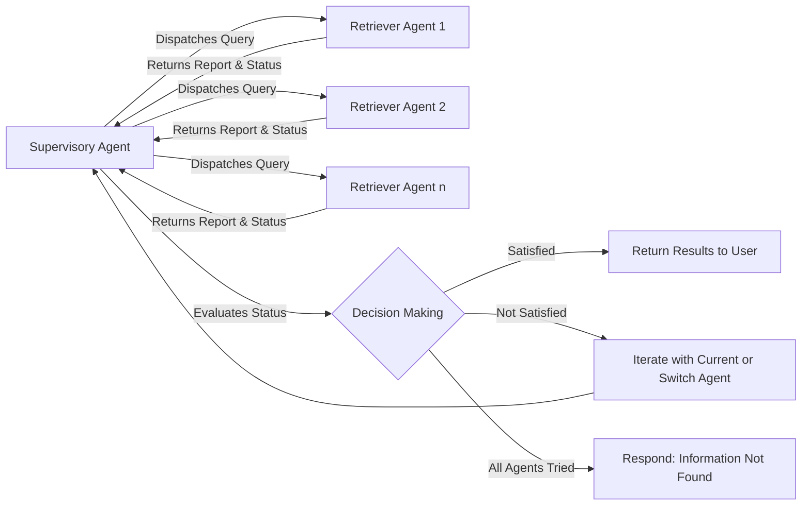

# Adaptive Swarm Retrieval: A Hierarchical Agent-Based Approach for Blind and Stateful Information Retrieval


## Introduction
In the rapidly evolving realm of artificial intelligence, the quest for efficient, adaptive, and accurate information retrieval systems has become ever more crucial. This paper introduces a groundbreaking Retrieval Agent Graph (RAG) system, an intricate hierarchy of agents that revolutionizes the way we access and extract information from diverse data sources. Central to our novel approach is a supervisor agent, adept at dynamically routing user queries to a constellation of specialized retriever agents, each expert in different document formats, be it textual, tabular, or multimedia. What sets our system apart is its blind information retrieval capability; at the outset, it has no predetermined knowledge of which retriever is best suited for a given query, enabling an adaptive and iterative process that seeks out the most relevant information.

The core contribution of this work is threefold: Firstly, we pioneer the concept of blind information retrieval within a multi-agent framework, showcasing our system's ability to intelligently discern and engage the appropriate agent without prior knowledge of its domain expertise. Secondly, this research marks the first implementation of a stateful multi-agent system employing a hierarchical architecture for information retrieval. Through this design, we underscore the robustness and flexibility of our RAG system, proving its efficacy across various data modalities and retrieval challenges. Thirdly, and most significantly, our methodology excels in scalability and resilience, attributes directly attributed to its modular, agentic architecture. This paves the way for its application in a wide array of information retrieval contexts, from academic research to commercial data analysis.

Our introduction of a stateful graph, delineating the communication pathways between the supervisory and retriever agents, underlines the innovative essence of our approach. This blog, therefore, not only demonstrates a quantum leap in adaptive, blind retrieval capabilities but also reinforces the potential of hierarchical agent-based systems in mastering the complexity and diversity of today's information landscape. Through rigorous evaluation, we reveal the system's unparalleled ability to navigate the intricacies of information retrieval with unprecedented accuracy and efficiency.

## The Proposed Method
Our method introduces a novel approach to information retrieval through a structured, stateful graph incorporating a supervisory agent and multiple specialized retriever agents. This model is designed to tackle complex queries by adaptively routing the query among a suite of retriever agents, each possessing unique capabilities for handling specific types of data (e.g., textual, tabular). The supervisory agent plays a crucial role in this network, functioning as the central node that dynamically dispatches queries and assesses the performance of each retriever agent in real-time.

### Adaptive and Blind Retrieval Mechanism
At the core of our method is an innovative adaptive and blind retrieval mechanism. Initially, the system lacks explicit knowledge regarding which type of retriever is best suited for a given query. It is through the supervisory agent’s real-time assessment and routing capabilities that the system dynamically identifies the most appropriate retriever agent. This process is blind in the sense that the determination is made iteratively and adaptively, based on the success or failure of the retriever agents in providing relevant information.

### Pictorial Viewpoint and Workflow
To clearly depict the proposed method, we utilize a Mermaid Markdown diagram that outlines the workflow:



### Detailed Workflow Description
1. **Query Dispatch**: The supervisory agent (SA) receives a query and dispatches it to one of the retriever agents (RA1, RA2, ..., RAn), initiating the retrieval process.
2. **Data Retrieval and Reporting**: Each selected retriever agent attempts to retrieve the relevant information related to the query. Regardless of success or failure, the agent returns a summary report and status to the supervisory agent.
3. **Evaluation and Decision Making**: Upon receipt of the summary report and status, the SA evaluates the outcome. If the retrieved information satisfies the query's requirements, the process moves to the final step. Otherwise, the SA decides to either iterate with the current agent (further refining the search) or switch to a different agent.
4. **Iterative Process**: This iterative process continues, adapting in real-time based on the performance of each retriever agent, until relevant information is successfully retrieved or all agents have been tried.
5. **Output or Failure**: If satisfactory information is retrieved, it is returned to the user. If after iterating through all available retriever agents no relevant information is found, the system responds with a message indicating that the desired information could not be located.

This proposed method highlights the hierarchical, adaptive, and stateful nature of our AI-driven information retrieval system, pointing towards a future where complex queries across diverse data types can be handled more effectively and efficiently.

## Python Implementation of the Proposed Method
This Python code serves as the main entry point of your proposed method implementation for a Retrieval Augmented Generation (RAG) system, featuring a unique architecture comprised of a supervisory agent and multiple specialized retriever agents. The purpose of this system is to adaptively navigate through various retrievers to fetch the most relevant information in response to a user query. For an extensive explanation of each module's implementation within the provided code snippet, we direct you to the dedicated GitHub repository link in [1].

```python
from langchain_core.messages import HumanMessage
from langgraph.graph import END

from build_agent import retrievers, superviser
from configs import parse_kwargs
from prompts import create_user_prompt
from state_graph import workflow


def main():

    kwargs = parse_kwargs()

    query = create_user_prompt(kwargs["subject"], kwargs["additional_info"])

    # Add nodes
    workflow.add_node("Supervisor", superviser)

    for member, retriever in zip(kwargs["members"], retrievers):
        workflow.add_node(member, retriever)

    # Add edges
    for member in kwargs["members"]:
        # We want our workers to ALWAYS "report back" to the supervisor when done
        workflow.add_edge(member, "Supervisor")  # add one edge for each of the agents

    # The supervisor populates the "next" field in the graph state
    # which routes to a node or finishes
    conditional_map = {k: k for k in kwargs["members"]}

    # conditional_map = {kwargs["member"]: kwargs["member"]}
    conditional_map["FINISH"] = END
    workflow.add_conditional_edges("Supervisor", lambda x: x["next"], conditional_map)

    # Finally, add entrypoint
    workflow.set_entry_point("Supervisor")

    # Compile the workflow
    graph = workflow.compile()

    for s in graph.stream({"messages": [HumanMessage(content=query)]}):
        if "__end__" not in s:
            print(s)
            print("----")


if __name__ == "__main__":
    main()
```

The code demonstrates the setup, initialization, and execution flow of the described multi-agent retrieval system. Let's break down its components and workflow:

1. **Imports and Setup:**
   - Imports necessary modules and classes, such as `HumanMessage` for generating human-readable messages, various components from `langgraph` and `langchain_core`, as well as project-specific modules (`build_agent`, `configs`, `prompts`, `state_graph`). These set up the groundwork for message handling, agent communication, configuration parsing, and workflow definition.

2. **`main` Function:**
   - The main execution context of the script, where the core logic is implemented.

3. **Query Construction:**
   - `kwargs = parse_kwargs()`: Parses additional arguments or configurations provided at runtime, which could include details on the subject of the query, additional information, and members (retriever agents).
   - `query = create_user_prompt(kwargs["subject"], kwargs["additional_info"])`: Constructs the initial query using user inputs based on the parsed arguments.

4. **Workflow Definition:**
   - The `workflow` object represents the stateful graph where nodes are agents (both the superviser and the retrievers), and edges represent communication paths between these agents.
   - Nodes are added to the workflow for both the superviser and each retriever agent, using information from `kwargs` to dynamically set this up based on runtime configuration.
   - Edges are added from each retriever agent back to the superviser, ensuring that after each retrieval attempt, the superviser can process the results and decide on the next steps.

5. **Routing Logic:**
   - A conditional mapping (`conditional_map`) is to map the next steps based on the superviser's decision, routing between different retriever agents or ending the process if a conclusion is reached.
   - The `workflow.add_conditional_edges` function sets this routing logic in place, based on the "next" field in the workflow state, directing the process either to a specific retriever or to finish the operation.
   - The `Supervisor` agent is set as the entrypoint to the graph.

6. **Execution and Compilation:**
   - The workflow is compiled into a `graph` object, which represents the fully set up RAG system ready for execution.
   - Execution is carried through `graph.stream(...)`, processing the initial user query (`HumanMessage(content=query)`) through the defined workflow, step by step, adapting and routing between agents as per the logic defined.
   
7. **Output Handling:**
   - During the stream processing, outputs generated at each step are printed, allowing users or developers to see the progress and responses generated by the system in real-time until the process concludes or ends with a special `"__end__"` marker.

8. **Conclusion:**
   - This code organizes a sophisticated retrieval system that combines hierarchical control with the flexibility of specialized retrieval agents. It encapsulates the proposed method's adaptive, stateful, and hierarchical swarm-like nature of operations in handling and processing user queries to retrieve relevant information dynamically.


## Results

### Setup
In our experiment, we employed a hierarchical swarm of agents, each utilizing advanced models to handle different types of data effectively. At the core of each agent's capacity for understanding and generating textual content was the "gpt-4-turbo-preview" model, ensuring sophisticated textual interpretation and response generation. For image and tabular data, our agents were equipped with the "gpt-4-vision-preview" model, showcasing our system's ability to process and interpret visual information with high accuracy. 

We introduced two specialized types of retrievers for our simulation environment: the first, `retriever_with_pdf`, used ChromaDB to efficiently retrieve textual data from PDF documents. The second, `retriever_with_img_table`, leveraged a multi-modal Qdrant vector store for extracting image and tabular data from PDFs. This retriever further utilized Microsoft's `table-transformer-detection` for precise extraction of table data from images.

Our test focused on a query exclusively answerable through tabular data within the LLAMMA2 paper, a comparison with its predecessor LLAMMA1 in terms of STEM-related topics. The fascinating aspect of this test was the lack of explicit directions concerning data type requirements, demanding that the system adaptively identify and utilize the correct retriever without prior insight.

### Adaptive and Blind Retrieval
The results of the experiment highlight the system's exceptional adaptive and blind retrieval capabilities. Initially, the supervisor agent, without explicit guidance on which retriever would best serve the query, began the retrieval process. Through dynamic interaction with the `retriever_with_pdf`, the system quickly realized the inadequacy of textual content in answering the query. Subsequently, without user intervention, it shifted to the `retriever_with_img_table`.

Below is the result of querying the proposed system with the question, "Directly compare the performance of Llama1 and Llama2 in STEM?", without providing any additional information about the source for retrieving relevant information to answer the query. The outputs from the proposed method are provided as follows:

```json
{'Supervisor': {'next': 'Retriever-PDF'}}
{'Retriever-PDF': {'messages': [HumanMessage(content="summary: The retrieved information does not directly compare the performance of Llama 1 and Llama 2 in STEM-specific benchmarks. However, it provides a general comparison across various models including Llama 1 and Llama 2 on benchmarks such as TruthfulQA, ToxiGen, MMLU, TriviaQA, Natural Questions, GSM8K, HumanEval, and BIG-Bench Hard. Llama 2's performance is highlighted in several aspects, such as outperforming ChatGPT on factual questions and showing competitive results against other models like GPT-4 and PaLM-2-L across different benchmarks. Specific STEM-related performance, such as on the GSM8K benchmark, shows Llama 2's performance in comparison to other models, but a direct STEM-focused comparison between Llama 1 and Llama 2 is not provided. status: failed", name='Retriever-PDF')]}}
{'Supervisor': {'next': 'Retriever-Image-Table'}}
{'Retriever-Image-Table': {'messages': [HumanMessage(content="summary: The comparison between LLAMA1 and LLAMA2 across various benchmarks in the STEM field indicates that LLAMA2 generally outperforms LLAMA1. Notably, in the MMLU benchmark, LLAMA2's scores exceed those of LLAMA1 for both the 13B and 70B model sizes. This trend of LLAMA2 showing superior performance is consistent across multiple benchmarks, highlighting its enhanced language understanding and reasoning capabilities in the STEM domain. status: satisfied", name='Retriever-Image-Table')]}}
{'Supervisor': {'next': 'FINISH'}}
```

The 'Supervisor' node initially routes the information to the 'Retriever-PDF' node. The 'Retriever-PDF' node then returns a summary of the analysis along with an overall status of 'failed', since the query is directly related to tabular data and the mentioned retriever lacks the capability to address this question. Consequently, upon receiving the failure status from the 'Retriever-PDF' node, the 'Supervisor' node selects the 'Retriever-Image-Table' node to retrieve the relevant information for answering this question. The 'Retriever-Image-Table' node provides a summary of its analysis and reports an overall status of 'satisfied', as the question is directly related to tabular data. Upon receiving the 'satisfied' status from the 'Retriever-Image-Table' node, the 'Supervisor' node concludes the retrieval process, as the information necessary for answering the question has been obtained.

This adaptive routing demonstrated not only the flexibility of the hierarchical swarm agent system but also its ability to tackle tasks blind, efficiently navigating through its internal structure to identify and utilize the most appropriate retriever for the necessary information.

### Stateful Nature and Hierarchical Swarm of Agents
The proposed system's stateful graph architecture facilitated a seamless and efficient iterative process between the supervisor and the retrievers. This structure ensured that information and context were preserved during the entire retrieval process, allowing for a nuanced understanding of each query's evolution and requirements. 

The hierarchical organization of the swarm of agents, enhanced by the specialized capabilities of each agent type, underscores the system's robustness and adaptability. The successful retrieval of specific tabular data to answer the query, with no prior indication of the nature of the retrieval needed, stands as a testament to the strength and flexibility of our RAG system. This adaptability, guided by the well-coordinated interaction between the supervisor agent and its retrievers, signifies a substantial leap forward in AI-driven information retrieval systems.

## Conclusion
In conclusion, the presented research introduces a novel Retrieval Agent Graph (RAG) system, featuring a supervisory agent and multiple specialized retriever agents, each adept in handling distinct types of document data. Central to this innovation is the adaptive and blind routing capability of the supervisory agent, which ingeniously navigates the uncertainties of query-specific retriever suitability without prior knowledge. This dynamic decision-making process is underpinned by a stateful graph architecture that not only facilitates seamless communication between the supervisory and retriever agents but also ensures a systematic iteration process for optimized information retrieval. The hierarchical swarm of agents, characterized by its flexibility and robustness, underscores a significant leap forward in the design of RAG systems. By iteratively engaging with retrievers and intelligently switching between them based on their performance, the system exhibits an unparalleled adaptability in retrieving the most relevant information for any given query. This approach not only enhances the efficiency of information retrieval but also epitomizes the system's capacity to learn and improvise in the face of complex retrieval challenges. The research heralds a promising horizon for the development of intelligent retrieval systems, offering insights into the possibilities of creating more responsive, adaptable, and capable RAG ecosystems in the realm of artificial intelligence.

## References
[1]: A. Shahmansoori, Adaptive Swarm Retrieval: A Hierarchical Agent-Based Approach for Blind and Stateful Information Retrieval, https://github.com/arash-shahmansoori/multi_modal_swarm_rag.git, 2024.
